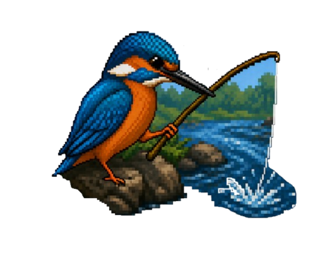
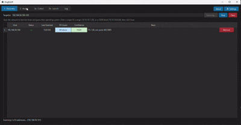
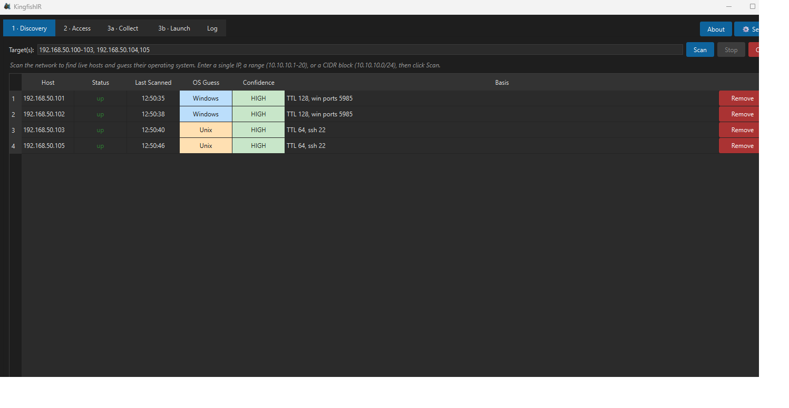
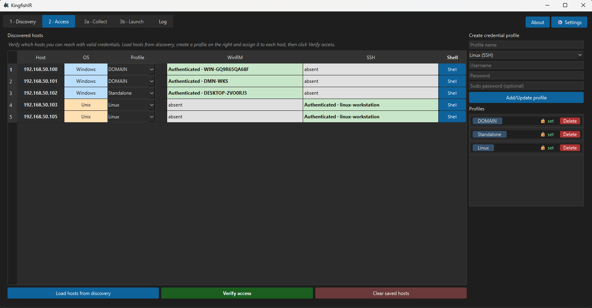
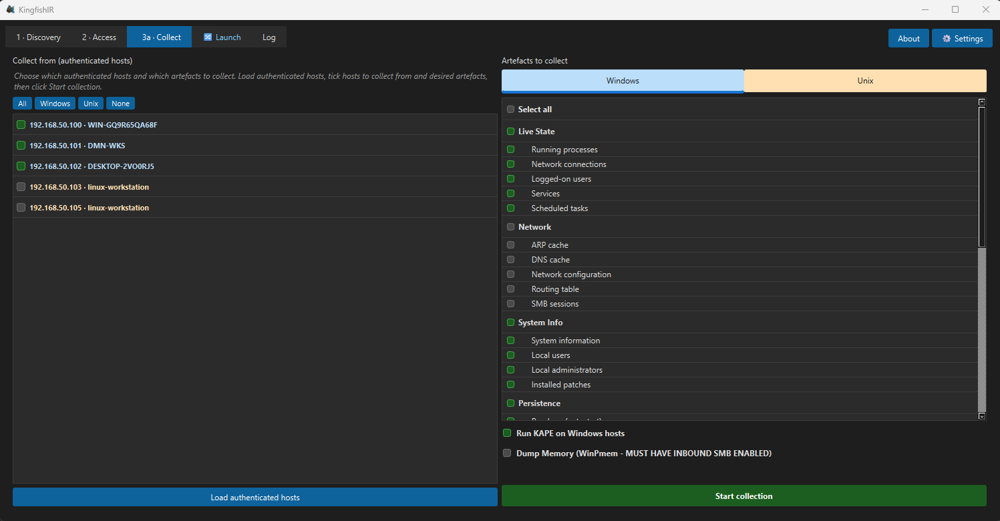
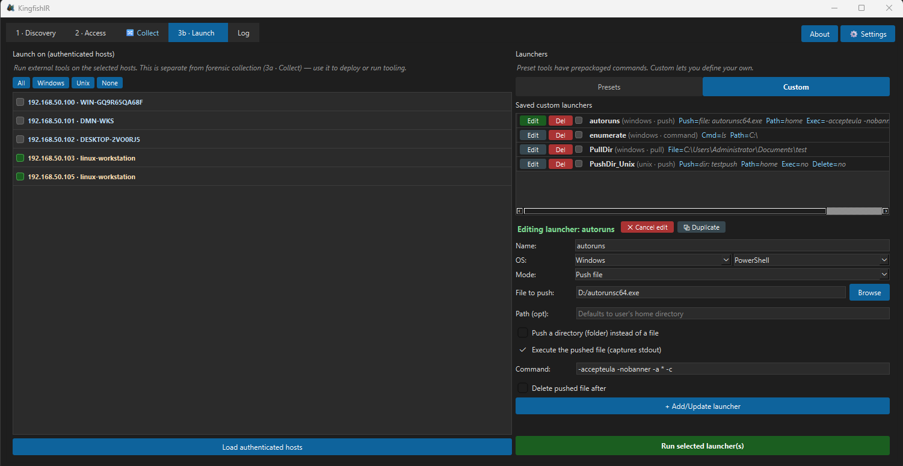
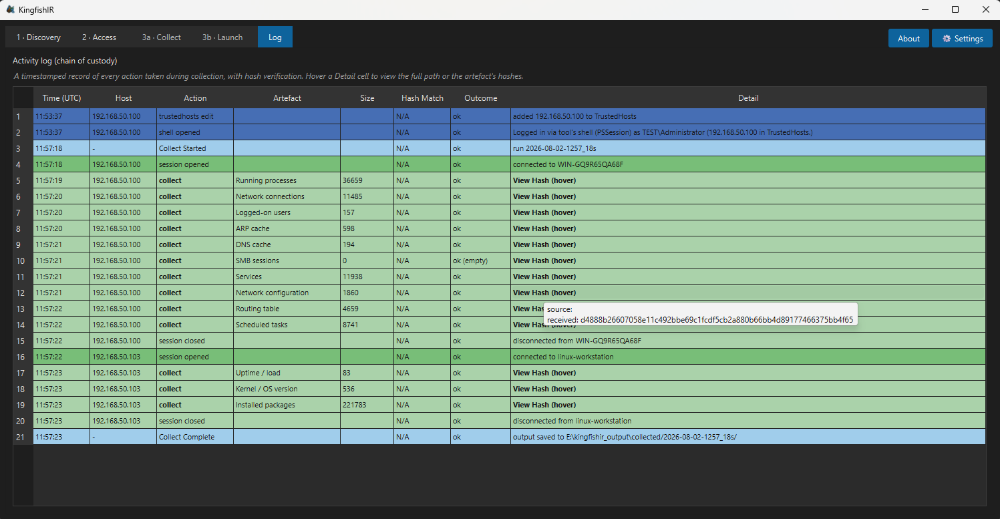

# KingfishIR
<p align="center">  </p> <h1 align="center">KingfishIR</h1> <p align="center"><i>Cross-platform, agentless digital-forensic triage.</i></p>
A cross-platform, **agentless** digital-forensic triage tool. A single Python
controller discovers hosts on a network, verifies remote access using credential
profiles, and collects forensic artefacts from **Windows** (over WinRM /
PowerShell Remoting) and **Unix/Linux** (over SSH) targets — using each
platform's native remote-management protocols, with **no agent pre-installed**
on the targets.

The design occupies a specific point in the tool landscape: cross-platform *and*
agentless *and* integrated (discovery → verification → collection in one
workflow), with forensic soundness (hashing, minimal footprint, chain of
custody) as a first-class concern.



*Scan a subnet, verify access, and collect artefacts — end to end.*

## Workflow

The interface follows the investigative workflow left-to-right across tabs:

1. **Discovery** — scan for live hosts and fingerprint their likely OS.
2. **Access** — assign credential profiles and verify remote access.
3a. **Collect** — pull forensic artefacts (with integrity hashing).
3b. **Launch** — deploy or run tooling on hosts (kept separate from collection).
4. **Log** — a timestamped chain-of-custody record of every action.

## Features

### Discovery
* Flexible target specification: single IP, range (`192.168.1.10-20`), CIDR
  (`192.168.1.0/24`), last-octet lists (`192.168.1.1,10,133`), or any
  comma-separated mix.
* OS fingerprinting (Windows/Unix) from TTL and open ports.
* Host inventory persists between sessions.

### Access
* Credential profiles (username, password, domain, sudo). **Passwords are never
  written to disk** and are re-entered each session.
* Per-host profile assignment and access verification over WinRM or SSH.
* **Host persistence** — the inventory and profile assignments are saved, but
  persisted hosts reload as *unverified* and must be re-verified each session,
  so the tool never acts on stale state. Verification state is shown as red
  ("verify" — never verified) or amber ("re-verify" — verified in a previous
  session, now stale).
* **Interactive shell** — once a host authenticates, open a native interactive
  session to it (SSH for Unix; an auto-authenticating PowerShell PSSession for
  Windows).

### Collect
* Select verified hosts and artefacts, then collect over the native protocol.
* Artefacts are **hashed at source and after transfer** to verify integrity, and
  saved under `collected/<run>/<host>/`.
* Integrated external tools: **KAPE** (Windows targeted collection), **UAC**
  (Unix artefact collection), and **WinPmem** (Windows memory capture, streamed
  over SMB for multi-GB images).
* Collection is blocked on any host not verified in the current session.

### Launch
Operational tooling, deliberately kept separate from forensic collection (its
own audit log and its own `launched/` output directory):
* **Presets** — deploy Sysmon or a Velociraptor agent.
* **Custom launchers** — user-defined actions, saved/editable/duplicable:
  * Run a command and capture stdout.
  * Push a file or directory (optionally execute it and capture output).
  * Pull a file or directory back (directories are archived automatically).

### Log
* Every action — discovery, verification, collection, hashing, launcher
  activity, interactive shell sessions — is timestamped and recorded, with
  source and post-transfer hashes for collected artefacts.
* Colour-coded by type, and written to CSV for an auditable record outside the
  application.

## Screenshots

### Discovery — flexible host scanning


### Access — credential profiles, verification, and persistent host state


### Collect — artefact selection with integrity hashing


### Launch — presets and custom launchers


### Log — chain-of-custody record


## Project layout

```
core/          research logic: discovery, access, collection, models, hashing,
               audit, credentials, artefacts, config, and the external-tool
               runners (kape_runner, uac_runner, winpmem_runner,
               launcher_runner, shell_launcher)
transports/    protocol wrappers behind one Transport interface
               (winrm_transport, ssh_transport)
gui/           the GUI layer (app.py)
tests/         unit tests
main.py        entry point
```

## Requirements

* Python 3.11+
* Windows controller (the interactive shell and some SMB/WinRM paths assume a
  Windows host running the tool)

Python dependencies (`requirements.txt`):

```
pypsrp          # WinRM / PowerShell Remoting
paramiko        # SSH
PySide6         # GUI
smbprotocol     # SMB (large-file / memory transfer)
```

## Setup

```bash
python -m venv .venv
.venv\Scripts\activate          # Windows
pip install -r requirements.txt
python main.py
```

External tools (KAPE, UAC, WinPmem, Sysmon, Velociraptor) are optional and
configured via their paths in the in-app **Settings** dialog.

## Building a standalone executable

The tool can be packaged with PyInstaller (see `KingfishIR.spec`):

```bash
pip install pyinstaller
pyinstaller KingfishIR.spec
```

## Academic context

Developed as an MSc dissertation project investigating cross-platform agentless
forensic collection and the operational and forensic trade-offs involved,
compared against agent-based approaches such as Velociraptor.

## Notes on forensic soundness

* Collected artefacts are hashed before and after transfer; both hashes are
  recorded in the log.
* Credentials are never persisted to disk.
* Persisted host state is treated as historical: re-verification is mandatory
  before any collection or launch action.
* Operational actions (agent deployment, arbitrary launchers) are separated from
  forensic collection, with their own audit trail and output location.
